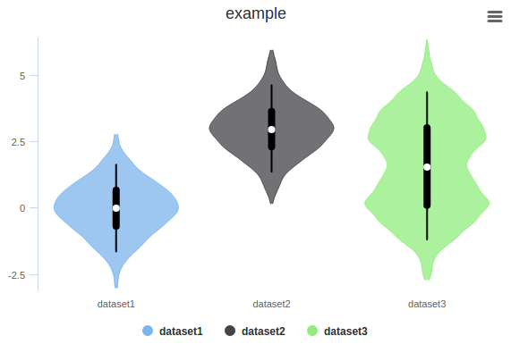
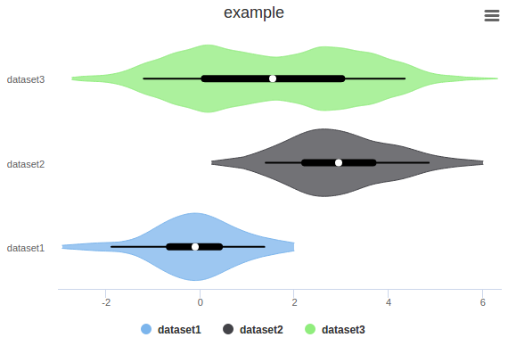

# violin
> A simple workaround to produce violin plot with [highcharts.js](http://www.highcharts.js)  
  
<pre>
<b>violin.Violin(center='median', box=(25,75), whiskers=(5,95))</b>

  <b>center</b>:    which central tendency to display: 'median'|'mean'
  <b>box</b>:       percentiles indicated by the box: pair of floats in range of [0,100]
  <b>whiskers</b>:  percentiles indicated by the whiskers: pair of floats in range of [0,100]

<b>methods:</b>

  <b>addSeries(data, name=None)</b>
    data:  list of values
    name:  name of the dataset

</pre>
  
## Examples
Plotting random data with example.py    

